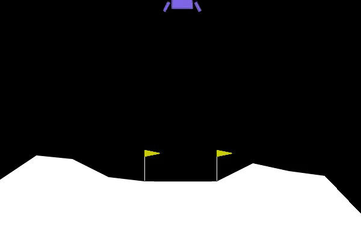
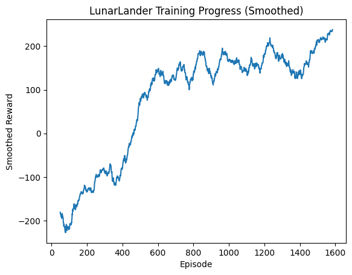

# 🛰️ PPO Agent on LunarLander-v3

This project trains a reinforcement learning agent using **Proximal Policy Optimization (PPO)** from [Stable-Baselines3](https://github.com/DLR-RM/stable-baselines3).  
The agent learns how to land a spacecraft safely in the classic **LunarLander-v3** environment.

---

## 🎯 Why PPO?
We used **PPO** because it is an **on-policy algorithm**:  
- It updates policies based on timesteps **within each episode**, not just after an episode ends.  
- This makes it stable and efficient for environments like LunarLander where continuous adjustments are needed.

---

## 📊 Training Progress
We trained the agent at different milestones and logged rewards & episode lengths.

- **Raw rewards** (per episode): noisy, shows actual training outcomes.  
- **Smoothed rewards** (rolling average over 50 episodes): shows learning trend more clearly.  
- **Episode length**: shows whether the agent is surviving longer as training progresses.  

---

## 🎥 Training Videos

We recorded the agent's performance at key milestones: 50,000, 200,000, and 500,000 training steps.

### 500,000 Steps - Peek at the Trained Model

---

## 📈 Example Reward Plot

---
